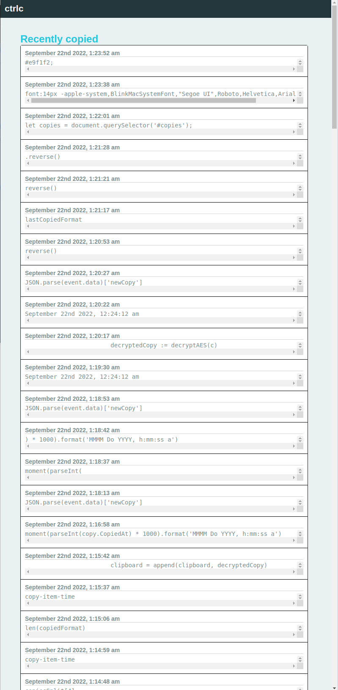

## ctrlc - Clipboard logger


ctrlc logs every copy you make while running and makes them accessible via hosted realtime ui.

#### License 
AGPL-3.0 license

#### Author 
Alex Padula

#### Versions
...........0.0.1

### Note
You must set your environment variable ```CTRLC_AES_32``` with a 32 byte secret key.

#### Building and running
Make sure you are in the ctrlc directory.
```
go build ctrlc.go -o bin/ctrlc
```

Run
```
./ctrlc
```

Open browser and go to:
```
http://localhost:47222
```

#### Program Features
- Appends copied text into ctrlc.dat
- AES Encryption
- Ties to HTTP frontend with realtime socket communication. (Default port is 47222)
- ~~Basic authentication~~

#### Donate
You can donate Ether:

#### Required

##### Unix Ubuntu type systems
```
sudo apt install libx11-dev
```
```
sudo apt-cache policy libx11-dev
```
```
sudo apt install libxinerama-dev
```
```
sudo apt install xorg-dev
```

##### Windows type systems
1. First download program:
```https://github.com/guycipher/ctrlc```

2. Install the latest version of GO:
```https://go.dev/dl/go1.19.1.windows-amd64.msi```

3. Go to Windows Icon(Start) and go to search and type "Advanced System Properties"

4. Click first option

5. Click "Environment Variables"

6. Add new variable adding GOPATH with value "C:/Users/{{YOU}}/go"

7. Save

8. Open CMD and type "go version"

9. You should see:
```
go version go1.19.1 windows/amd64
```

10. Install MSYS2

```
https://github.com/msys2/msys2-installer/releases/download/2022-09-04/msys2-x86_64-20220904.exe
```

11. Install with no special options.

12. Launch MSYS2

13. Update packages:
``pacman -Syu``

14. Reopen and then install git
```pacman -S git```

15. install gcc

```
pacman -S mingw-w64-x86_64-gcc
```

16. and GSL

```
pacman -S mingw-w64-x86_64-gsl
```

17. Go back to your Advanced System Settings go to Environment Variables but this time
you have to edit your system variables. Scroll down until you find "Path" click edit and add
a new variable.

18. Locate to ```C:\msys64\mingw64\bin```

19. Now save go back to Environment variables and under User varibales go to Path and click Edit
add a ```;``` after ```WindosApps``` like so:
```WindowsApp;C:\Users\{{YOU}}\go\bin```

20. Go to ctrlc directory and:
```cd C:\Users\{{you}}\Desktop\ctrlc-main```

21. ```go build ```

22. Click on ctrlc.exe you can find the UI at ```http://localhost:47222```